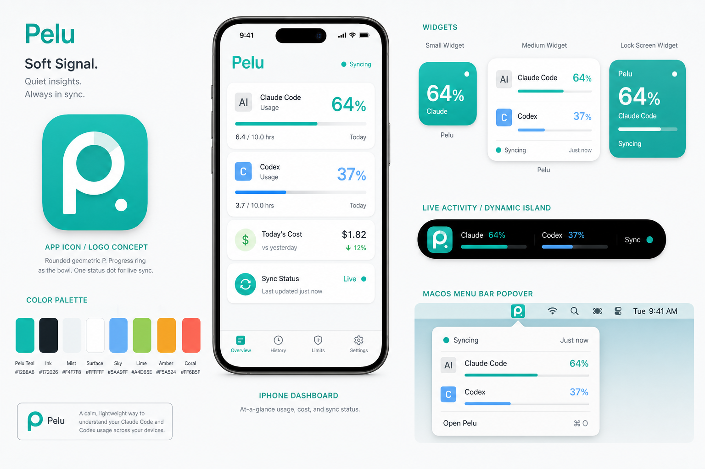
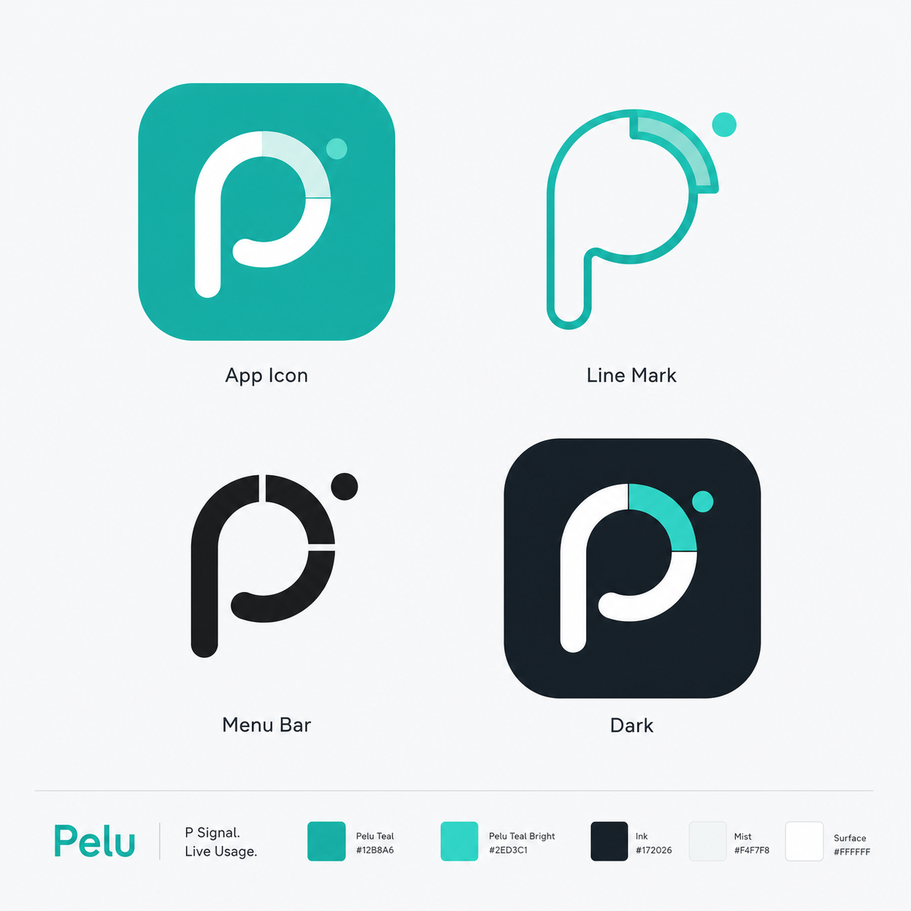
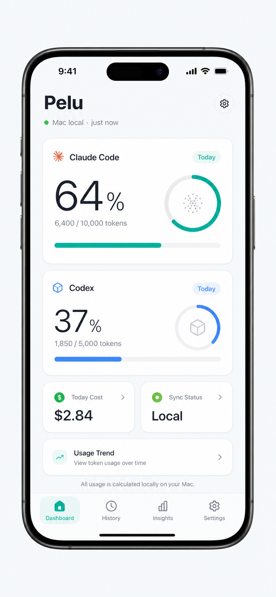
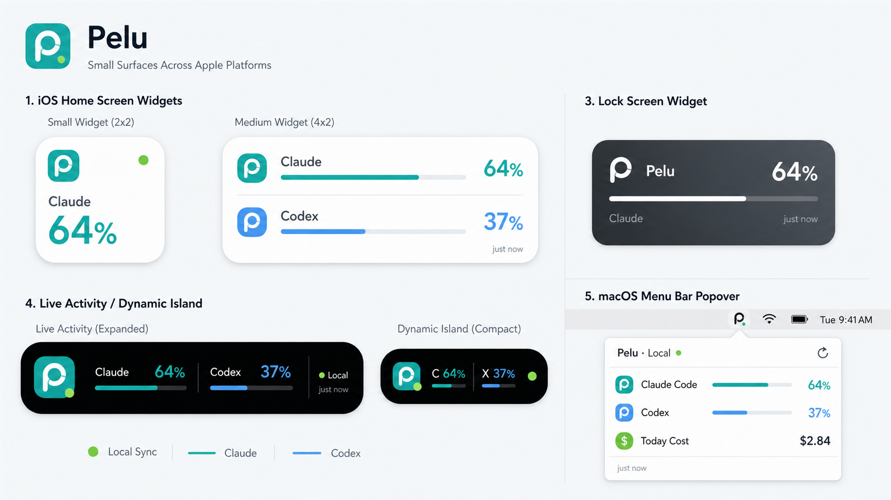

# Pelu 視覺圖片整理

這份文件整理目前依照 [`pelu-visual-identity.md`](./pelu-visual-identity.md) 生成的 Pelu 產品視覺圖。用途是先確認整體方向，再決定要不要把 logo、App icon、Widget、Live Activity 等拆成正式設計資產。

---

## 1. 整體視覺總覽

### 用途

- 確認 Pelu 的整體視覺語氣。
- 同時檢查 logo、配色、iPhone App、Widget、Live Activity、macOS menu bar 是否像同一個產品。
- 適合放進研發計畫書或設計提案當第一張視覺參考。

### 對應研發計畫

- Phase 2：Mac 端 Menu Bar App
- Phase 4：iPhone 主 App
- Phase 5：Widget Extension
- Phase 6：Live Activity

---

## 2. Logo / App Icon 探索

### 推薦方向

採用 **P Signal** 作為 Pelu 的 logo 核心：

- 圓潤幾何字母 P。
- P 的內圈像用量進度環。
- 小狀態點代表即時同步。
- 可延伸成 App icon、menu bar template icon、深色模式圖示。

### 後續需要

- 將選定版本重畫成 SVG / PDF vector。
- 製作 iOS App Icon 全尺寸圖。
- 製作 macOS menu bar template image。
- 製作 Widget / Live Activity 小尺寸符號。

---

## 3. iPhone Dashboard Mockup

### 推薦方向

主畫面採用低噪音 dashboard：

- 上方顯示 Pelu 與同步狀態。
- Claude Code / Codex 用量用大數字與進度條呈現。
- 今日花費與同步狀態放成小卡片。
- 顏色只在進度、狀態點、提醒狀態出現。

### 對應研發計畫

- Phase 4：iPhone 主 App
- Onboarding 完成後的主要畫面
- Dashboard 卡片自訂功能的視覺基準

---

## 4. Widget / Live Activity / Menu Bar

### 推薦方向

小尺寸介面要比主 App 更克制：

- Widget 只保留最重要的百分比與進度。
- Lock Screen Widget 盡量單色、短文字。
- Live Activity 顯示 Claude / Codex 目前狀態，不放多餘說明。
- macOS menu bar popover 以資訊清楚為主，不做大型卡片。

### 對應研發計畫

- Phase 2：Mac Menu Bar popover
- Phase 5：Widget 小尺寸、中尺寸、鎖屏版本
- Phase 6：Live Activity / Dynamic Island

---

## 5. 建議採用結論

目前建議先採用這一套方向：

- **主視覺**：Soft Signal
- **Logo**：P Signal
- **主色**：Pelu Teal `#12B8A6`
- **App 介面**：Apple 原生工具感、白底、清楚卡片、低噪音
- **小尺寸介面**：只保留數字、進度、狀態點

下一步如果要進入實作，建議優先做這 4 個正式資產：

1. `PeluLogo.svg`
2. `AppIcon.appiconset`
3. `MenuBarIcon.pdf`
4. SwiftUI 色票與 Typography token

---

## 6. 目前圖片檔案

| 圖片 | 檔案 |
|---|---|
| 整體視覺總覽 | `visuals/pelu-visual-board.png` |
| Logo / App Icon 探索 | `visuals/pelu-logo-app-icon-exploration.png` |
| iPhone Dashboard | `visuals/pelu-iphone-dashboard-mockup.png` |
| Widget / Live Activity / Menu Bar | `visuals/pelu-small-surfaces-mockup.png` |

